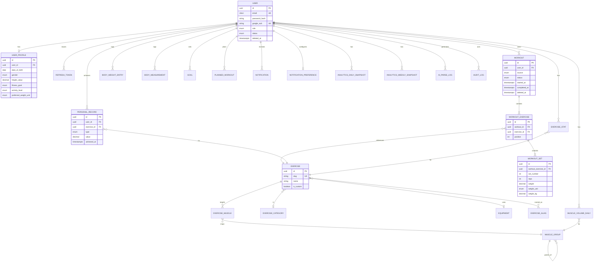

# 06 — Entity Relationship Diagram

## Logical ERD (Mermaid)

## Relationship Cardinalities (Text)

| Parent | Child | Cardinality | On delete |
|--------|-------|-------------|-----------|
| User | Profile | 1:0..1 | CASCADE |
| User | Workouts | 1:N | CASCADE |
| Workout | WorkoutExercises | 1:N | CASCADE |
| WorkoutExercise | Sets | 1:N | CASCADE |
| Exercise | WorkoutExercises | 1:N | RESTRICT |
| Exercise | Muscles | 1:N | CASCADE |
| MuscleGroup | Self | 1:N tree | SET NULL |
| User | PRs | 1:N | CASCADE |
| User | Analytics snapshots | 1:N | CASCADE |

## Physical Notes

- All FKs indexed (Prisma does this for relation fields used in `@@index` where needed).
- Soft-deleted workouts remain for referential integrity of PRs that point at `workout_id` (nullable string without FK in PR table to avoid hard coupling — optional FK can be added without cascade).
- Catalog tables (`exercises`, `muscle_groups`) are rarely deleted; prefer `is_active` / `deleted_at`.
