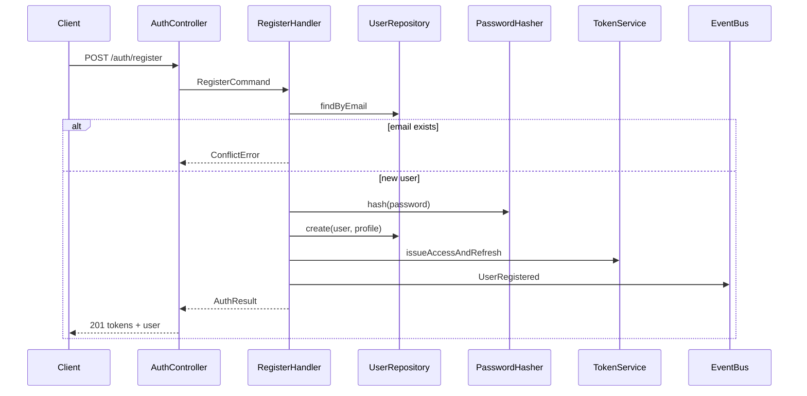
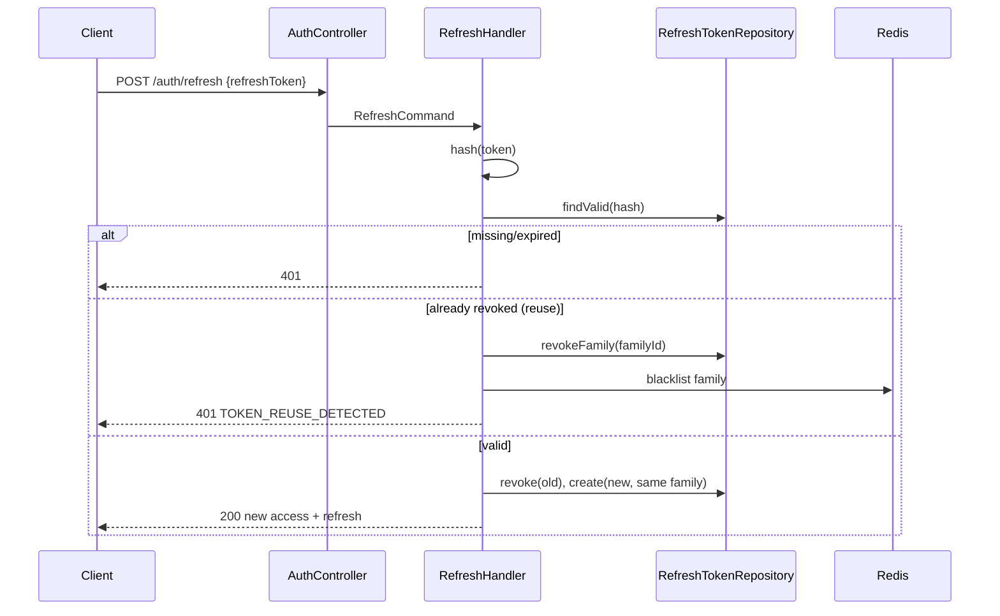
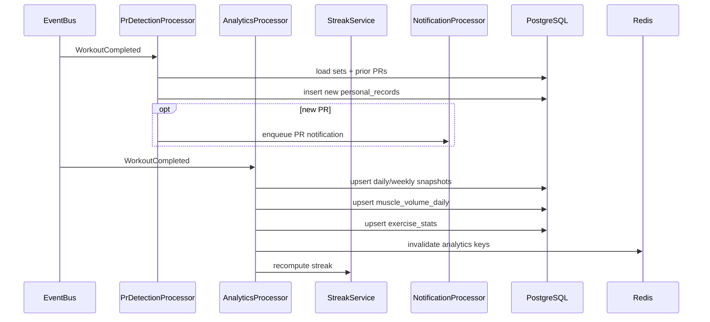
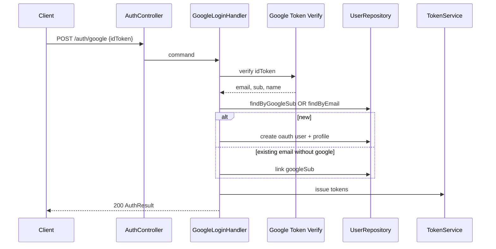
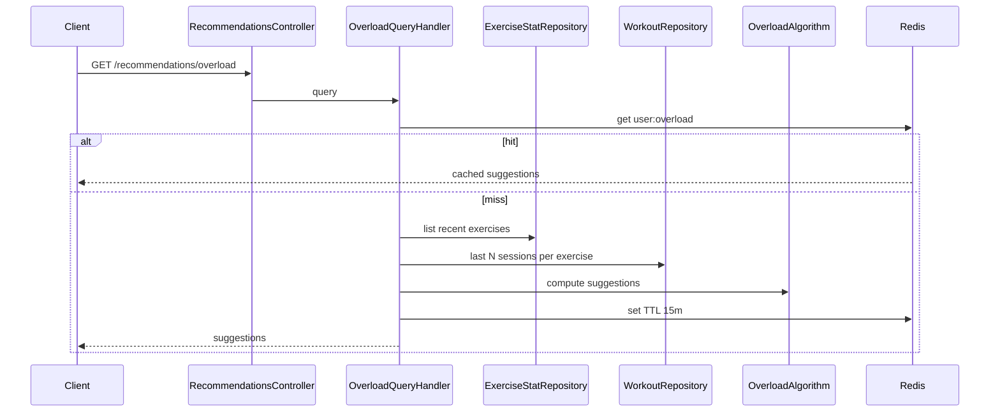

# 07 — Sequence Diagrams

## 1. Register + Login



## 2. Refresh Token Rotation



## 3. AI Text Parse → Confirm Workout

```mermaid
sequenceDiagram
  participant C as Client
  participant AI as AiController
  participant Parse as ParseTextHandler
  participant Provider as AiParserPort
  participant Resolve as ExerciseResolver
  participant Log as AiParseLogRepo
  participant W as WorkoutsController
  participant Create as CreateWorkoutHandler
  participant Bus as EventBus
  participant Q as BullMQ

  C->>AI: POST /ai/parse-text
  AI->>Parse: command
  Parse->>Provider: parse(text)
  Provider-->>Parse: raw structured candidates
  Parse->>Resolve: resolve names → exercise IDs
  Parse->>Log: write ai_parse_logs
  Parse-->>C: ParsedWorkoutDraft

  Note over C: User confirms / edits draft

  C->>W: POST /workouts (structured + idempotencyKey)
  W->>Create: CreateWorkoutCommand
  Create-->>C: 201 Workout
  C->>W: POST /workouts/:id/complete
  W->>Bus: WorkoutCompleted
  Bus->>Q: analytics + pr-detection jobs
```

## 4. Workout Complete → Analytics & PR



## 5. Google OAuth Login



## 6. Progressive Overload Recommendation Read


