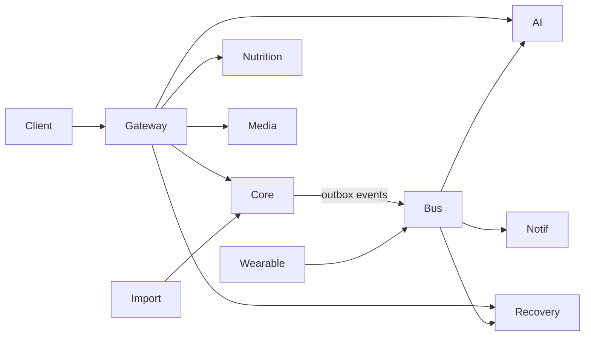

# Phase 2 — Implementation Guide (Documentation Only)

> **Do not implement in Phase 1.** This guide is the blueprint for the intelligence & lifestyle layer after MVP ships.

---

## 1. Objectives

Turn the MVP logger into an **AI fitness coach**: recommendations, recovery, nutrition/lifestyle tracking, imports, richer analytics, and a wearable sync *layer*.

---

## 2. Microservice Boundaries

Phase 1 is a modular monolith. Phase 2 **selectively extracts** high-CPU / high-churn workloads while keeping a single write model for core training data initially.

| Service | Responsibility | Talks to |
|---------|----------------|----------|
| **API Gateway / BFF** | Authn edge, rate limit, routing | All |
| **Core API** (existing) | Users, workouts, exercises, goals | Postgres primary |
| **AI Orchestrator** | Parse, coach chat, weekly summary, recommendations | LLM providers, Core read APIs, Redis |
| **Nutrition Service** | Foods, meals, macros, water | Own Postgres schema / DB |
| **Recovery Service** | Sleep, HRV inputs, recovery score | Own DB + Core read |
| **Media Service** | Progress photos, S3, moderation | S3, Core user ids |
| **Import Worker** | Strong/Hevy/CSV imports | Queue + Core write APIs |
| **Notification Worker** | Smart push/email digests | FCM/APNs, SES |
| **Wearable Sync Ingress** | OAuth + normalized activity events | Provider APIs → event bus |

### Boundary rules

- Synchronous HTTP only for user-facing request/response.
- Cross-service **facts** travel via **transactional outbox → Redis Streams or Kafka** (Kafka preferred if already planning Phase 3).
- AI Orchestrator is **stateless**; prompts/results logged to `ai_*` tables in Core or AI DB.
- Nutrition never writes workout sets; it may *read* volume for calorie suggestions.



---

## 3. Database Design (Additive)

### 3.1 Core DB additions

```
workout_templates
workout_template_exercises
workout_template_sets
habits / habit_checkins
recovery_scores          -- denormalized daily score for charts
ai_conversations / ai_messages
ai_weekly_summaries / ai_monthly_reports
goal_predictions
import_jobs / import_job_rows
wearable_connections / wearable_raw_events / wearable_normalized_events
feature_entitlements     -- prep for Phase 3 billing
```

### 3.2 Nutrition DB (separate schema or service DB)

```
foods (catalog)
food_portions
meals
meal_items
water_logs
supplement_catalog
supplement_logs
nutrition_daily_summaries
```

### 3.3 Recovery / Lifestyle

```
sleep_sessions
body_fat_entries
progress_photos
recovery_factors_daily
```

### Soft delete / audit

Same conventions as Phase 1. Media objects: soft delete DB row + S3 lifecycle.

---

## 4. Feature Designs

### 4.1 AI Workout Recommendation Engine

**Purpose:** Propose next workout from history, muscle volume balance, overload suggestions, schedule, and recovery score.

**Algorithm (ensemble)**

1. **Muscle deficit score** — trailing 7/14d volume vs user baseline per muscle
2. **Overload candidates** — from Phase 1 overload module
3. **Recovery gate** — if recovery score < threshold → prefer mobility / lower intensity / rest
4. **Recency penalty** — avoid same pattern 2 days in a row unless user goal dictates
5. **Equipment filter** — from profile gym equipment list (new profile field)
6. Rank candidate sessions (Push/Pull/Legs/Upper/… patterns learned from user history clusters)

**Output:** `RecommendedWorkout` draft (same shape as parse draft) + rationale bullets.

**APIs**
- `GET /ai/recommendations/next-workout`
- `POST /ai/recommendations/next-workout/accept` → creates planned or in-progress workout
- `POST /ai/recommendations/feedback` `{ helpful: boolean }`

**Jobs:** nightly precompute top recommendation per active user; on-demand refresh.

---

### 4.2 AI Recovery Engine

**Inputs:** sleep duration/quality, recent volume, PR density, subjective soreness (optional), wearable strain if present.

**Score:** 0–100  
`recovery = w1*sleep + w2*loadFreshness + w3*hrvProxy - w4*fatigue`

**APIs**
- `GET /recovery/today`
- `GET /recovery/history`
- `POST /recovery/checkin` (soreness, stress 1–5)

**Caching:** daily key; recompute when sleep/workout events arrive.

---

### 4.3 Nutrition / Water / Supplements

**Philosophy:** quick add + barcode later; AI meal text parse mirrors workout parse.

**APIs (Nutrition service)**
- `POST /nutrition/meals/parse-text`
- `CRUD /nutrition/meals`
- `CRUD /nutrition/water`
- `CRUD /nutrition/supplements`
- `GET /nutrition/summary/daily`

**Macros:** user targets from goal + Mifflin-St Jeor TDEE estimate (document as estimate, not medical advice).

---

### 4.4 Sleep Tracking

- Manual log + wearable import
- `sleep_sessions`: start, end, stages JSON optional, quality

---

### 4.5 Progress Photos & Body Fat

- Photos via Media service: presigned S3 upload, privacy flag
- Body fat: manual % or caliper; DEXA import later
- Side-by-side compare API

---

### 4.6 AI Chat Coach

**Architecture**
- Conversation store + tool-calling LLM
- Tools: `get_recent_workouts`, `get_analytics_overview`, `get_overload`, `get_recovery`, `create_planned_workout` (confirm step)

**Safety**
- System prompt: no medical diagnosis; escalate disclaimers
- PII minimization in prompts
- Rate limits + token budgets per user tier

**APIs**
- `POST /ai/coach/sessions`
- `POST /ai/coach/sessions/:id/messages` (SSE stream)
- `GET /ai/coach/sessions`

---

### 4.7 Habit Tracker

- Habits: `type`, schedule RRULE-like, streak
- Check-ins daily
- Linked to notifications

---

### 4.8 Smart Notifications

Rules engine (BullMQ repeatable):
- Train reminder if no workout by local evening + goal frequency unmet
- Recovery low → suggest rest
- Weekly summary ready
- Streak at risk

User prefs from Phase 1 extended with quiet hours.

---

### 4.9 Goal Prediction

Time-series: linear / simple Bayesian on e1RM or body weight trend → ETA to goal.  
Store `goal_predictions` with confidence interval; refresh weekly.

---

### 4.10 Workout Templates & Exercise Recommendations

- Templates CRUD; instantiate to workout
- Exercise recommendations: similar muscle, substitute equipment, avoid recent injuries tags

---

### 4.11 Imports (Strong / Hevy / CSV)

**Flow**
1. Upload file → S3
2. `import_jobs` row `PENDING`
3. Worker parses → validates → maps exercises via alias resolver
4. Batch create workouts via Core internal API (idempotent external ids)
5. Enqueue analytics backfill range

**APIs**
- `POST /imports` (multipart, source enum)
- `GET /imports/:jobId`
- `POST /imports/:jobId/cancel`

---

### 4.12 Wearable Sync Layer

Not full vendor depth (Phase 3). Phase 2 delivers:

- `WearableProvider` port: `exchangeAuth`, `fetchActivities(since)`
- Normalized event: `{ type: WORKOUT|STEPS|SLEEP|HR, start, end, payload }`
- Idempotent upsert by `provider + externalId`
- Mapping workout → optional Core workout stub (user confirm)

Providers stubbed: Apple Health (mobile-upload), Google Fit, Garmin, WHOOP, Fitbit.

---

### 4.13 Analytics Dashboard V2 + AI Reports

- New chart types: muscle radar, PR timeline, adherence
- `WeeklyAiSummary` job: LLM over week's snapshots + workouts → markdown/JSON sections
- `MonthlyAiReport` similarly; store for history

**APIs**
- `GET /analytics/v2/dashboard`
- `GET /ai/reports/weekly/latest`
- `GET /ai/reports/monthly/:yyyyMm`

---

## 5. Background Jobs & Queues

| Queue | Jobs |
|-------|------|
| `ai.recommend` | nightly + on-demand |
| `ai.summary` | weekly/monthly |
| `ai.coach` | long tool traces (optional) |
| `import.parse` | file imports |
| `recovery.score` | daily recompute |
| `nutrition.rollup` | daily macros |
| `notify.smart` | rule evaluation |
| `wearable.sync` | per connection poll |
| `analytics.backfill` | post-import |

---

## 6. Caching Strategy

- Recommendations: 1–6h TTL
- Nutrition food search: Redis + CDN-friendly catalog
- Recovery today: until next event
- Coach: no cache of answers; cache tool read models

---

## 7. Expected Scalability

| Component | Phase 2 target |
|-----------|----------------|
| Core API | 5–10k RPS read with replica |
| AI Orchestrator | Autoscale on queue depth; cap concurrency per provider |
| Import | Horizontal workers; backpressure on Core writes |
| Media | S3 + CloudFront; never through API pods |

Bottleneck: LLM latency/cost — mitigate with precompute, smaller models for classifications, rules-first parsers.

---

## 8. Security & Compliance Additions

- Separate encryption for progress photos
- Nutrition health disclaimer
- OAuth token vault for wearables (KMS)
- Entitlement checks middleware (prep subscriptions)

---

## 9. Testing Focus

- Recommendation determinism with frozen clocks/fixtures
- Import golden files (Strong/Hevy samples)
- Coach tool-permission tests (cannot delete others' data)
- Recovery score unit tests
- Contract tests between services (Pact or OpenAPI)

---

## 10. Phase 2 Delivery Order

1. Outbox + event versioning  
2. Templates + exercise substitutes  
3. Imports + analytics backfill  
4. Recovery score + sleep  
5. Nutrition/water/supplements  
6. Recommendation engine  
7. Coach chat  
8. Smart notifications + AI weekly summary  
9. Wearable layer stubs  
10. Media / body fat / habits / goal prediction  

**Estimate:** 4–6 months with 2–3 engineers (see Phase 1 timeline doc).
