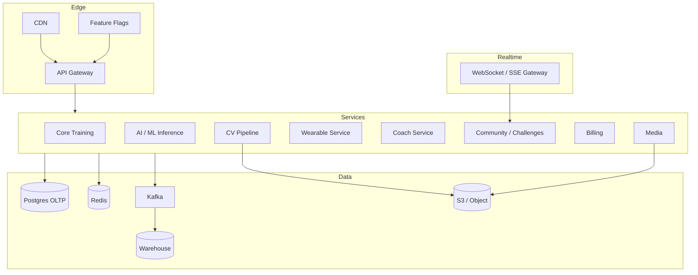

# Phase 3 — Implementation Guide (Documentation Only)

> **Do not implement now.** Prepare after Phase 2. This is a staff-level guide for platform, CV, wearables depth, growth features, and global scale.

---

## 1. Objectives

Evolve from coaching app to **fitness platform**: computer vision form feedback, deep wearable integrations, coach-client tooling, community/marketplace, subscriptions, and multi-region reliability with ML-driven insights.

---

## 2. Capability Map

| Domain | Features |
|--------|----------|
| Computer Vision | Video upload, pose detection, rep/tempo/ROM, form feedback |
| Wearables | Apple Health, Google Fit, Garmin, WHOOP, Fitbit (production depth) |
| Coach Platform | Coach dashboard, client management |
| Growth | Marketplace, community, challenges, leaderboards, achievements |
| Monetization | Subscriptions, payments, entitlements |
| Intelligence | Recommendation v2, predictive analytics, ML models |
| Data Platform | Warehouse, BI |
| Platform Eng | Multi-region, H-scale, Kafka, flags, offline sync, DR, observability, perf |

---

## 3. Target Architecture



### Service boundaries (Phase 3)

| Service | Notes |
|---------|-------|
| **CV Pipeline** | Async GPU workers; never block API |
| **Wearable Service** | Vendor OAuth, webhooks, normalization, conflict resolution |
| **Coach Service** | Orgs, client invites, shared programs, notes |
| **Social** | Feed, challenges, leaderboards (event-sourced counters) |
| **Billing** | Stripe (or similar); webhooks → entitlements |
| **ML Platform** | Feature store + batch/streaming training; inference sidecars |
| **Warehouse** | Snowflake/BigQuery/Redshift; dbt models for BI |

---

## 4. Computer Vision Form Detection

### Pipeline

1. Client requests presigned upload → S3 `videos/{userId}/{id}`
2. `POST /cv/sessions` creates job `QUEUED`
3. Kafka topic `cv.video.uploaded`
4. Worker: validate → transcode (optional) → pose model frame batch
5. Derive: rep count, tempo (ecc/con), ROM angles, key fault heuristics
6. LLM or rules layer → human-readable feedback
7. Results JSON + annotated thumbnail to S3; notify user

### Data model

```
cv_sessions(id, user_id, exercise_id, s3_key, status, created_at)
cv_results(session_id, reps, tempo_json, rom_json, faults_json, confidence)
cv_frame_metrics(session_id, t_ms, keypoints_ref)  -- optional sampled
```

### APIs

- `POST /cv/sessions` / `GET /cv/sessions/:id`
- `GET /cv/sessions/:id/feedback`
- Webhook/WS progress events

### Non-functional

- Max video length/size; virus scan
- GPU autoscaling; queue SLAs
- Model versioning (`model_semver` on results)
- Privacy: default private; retention policy

### Algorithms (high level)

- Pose: BlazePose / MoveNet / custom Lift models
- Rep segmentation: peak detection on joint angle time series
- Tempo: time between ROM extrema
- ROM: min/max joint angles vs exercise template
- Faults: rule thresholds (e.g. depth, valgus) + classifier later

---

## 5. Wearable Integration (Deep)

| Provider | Pattern |
|----------|---------|
| Apple Health | Mobile SDK → batch upload to Wearable Ingress |
| Google Fit | OAuth + REST |
| Garmin | OAuth + ping/pull |
| WHOOP | OAuth + webhooks |
| Fitbit | OAuth + subscriptions |

**Conflict policy:** user-preferred source per metric; never double-count volume if wearable workout matches logged workout (time-window dedup).

**APIs:** connection CRUD, sync now, mapping review UI endpoints.

---

## 6. Coach Dashboard & Clients

### Multi-tenancy

- `organizations`, `memberships` (COACH, CLIENT, ADMIN)
- RLS or strict `org_id` filters in Coach service
- Coaches assign programs/templates; view consented analytics

### APIs

- Org CRUD, invites, client list
- Assign workout/template
- Coach notes, check-ins
- Aggregate adherence dashboard

---

## 7. Marketplace, Community, Challenges

- **Marketplace:** sell programs/templates; billing entitlements unlock content
- **Community:** posts, comments, reactions (moderation queue)
- **Challenges:** date-bounded goals; leaderboard via Redis sorted sets + Kafka counters
- **Achievements:** rule engine on events (first PR, 30-day streak)

Moderation + abuse reporting mandatory before public launch.

---

## 8. Subscriptions & Payments

- Stripe Customer + Subscription + Customer Portal
- Webhook → `entitlements` (feature flags per plan)
- Plans: Free / Pro / Coach Seat
- Dunning, tax, app store IAP alignment (if mobile stores)

**Never** trust client for premium AI/CV access — enforce at gateway.

---

## 9. Admin Dashboard

- User support tools, impersonation with audit
- Catalog CMS
- Feature flags UI
- Import/CV job inspection
- Abuse / ban

---

## 10. Recommendation Engine v2 & Predictive Analytics

### v2 signals

- Phase 2 ensemble +
- Recovery + wearable strain
- CV form risk (reduce load if faults high)
- Schedule constraints
- Marketplace program affinity
- Contextual bandit / Thompson sampling for exploration

### Predictive models

- Injury risk proxy (conservative, non-diagnostic)
- Goal ETA (survival / regression)
- Churn propensity (growth)
- Volume response curves per user

### MLOps

- Feature store (user_exercise_stats, weekly_volume_vector, …)
- Training pipelines (batch)
- Online inference service with fallback to v1 rules
- Shadow mode → canary → full

---

## 11. Data Warehouse & BI

- CDC from Postgres (Debezium) → Kafka → Warehouse
- dbt: `fact_workouts`, `fact_sets`, `dim_exercises`, `fact_subscriptions`
- BI: Metabase/Looker/QuickSight for exec + product

---

## 12. Multi-Region, Scale, Kafka

### Multi-region

- Active-passive first; active-active later with user sticky region
- Global Aurora / Cockroach consideration for identity; regional training data
- Object storage replication

### Kafka topics (examples)

`workout.completed`, `pr.achieved`, `cv.job.*`, `wearable.event.normalized`, `billing.entitlement.changed`, `social.challenge.progress`

### Horizontal scaling

- Stateless APIs behind NLB
- Partition keys = `userId` for ordered processing
- Read replicas + Redis for hot aggregates
- CQRS read models for leaderboards

---

## 13. Feature Flags & Offline Sync

- Flags: LaunchDarkly / Unleash / custom
- Offline: client write-ahead log → sync API with vector clocks / `updatedAt` + conflict policy (`client_wins` for sets edits with merge UI)

---

## 14. Disaster Recovery & Observability

| Item | Target |
|------|--------|
| RPO | ≤ 5–15 min (PITR) |
| RTO | ≤ 1 hour regional failover |
| Tracing | OpenTelemetry → Jaeger/X-Ray |
| Metrics | RED + queue depth + LLM/CV cost |
| Logs | Structured JSON, central sink |
| Alerting | Error rate, saturation, DLQ depth |

Chaos drills quarterly; backup restore tested.

---

## 15. Performance Optimization Themes

- Precompute leaderboards and recommendations
- Materialized views / clickhouse for heavy analytics if needed
- CV frame sampling vs full video
- Connection pooling (PgBouncer)
- Avoid N+1 with DataLoader patterns
- Edge cache public catalog

---

## 16. Security (Phase 3 additions)

- Org RBAC, consent for coach data access
- Payment PCI SAQ-A via Stripe
- Video access via short-lived signed URLs
- Threat model: scraped leaderboards, fake wearables, prompt injection in coach
- Bug bounty before scale marketing

---

## 17. Suggested Implementation Waves

| Wave | Focus | Duration (indicative) |
|------|-------|------------------------|
| 3A | Billing + entitlements + admin | 6–8 weeks |
| 3B | Coach orgs + client mgmt | 8–10 weeks |
| 3C | Wearables production | 10–14 weeks |
| 3D | CV MVP (one lift) | 12–16 weeks |
| 3E | Social/challenges/achievements | 8–12 weeks |
| 3F | Marketplace | 8–10 weeks |
| 3G | ML v2 + warehouse | continuous |
| 3H | Multi-region + DR + offline | 10–16 weeks |

Waves can parallelize across squads; **CV** and **multi-region** are longest poles.

---

## 18. Exit Criteria for “Platform Ready”

- Paid conversion path live
- At least one CV exercise with measured accuracy benchmark
- Two wearables in production with dedup
- Coach can manage 100+ clients on a tenant
- Kafka consumer lag SLOs met
- DR runbook executed successfully once
- Observability covers all critical user journeys
